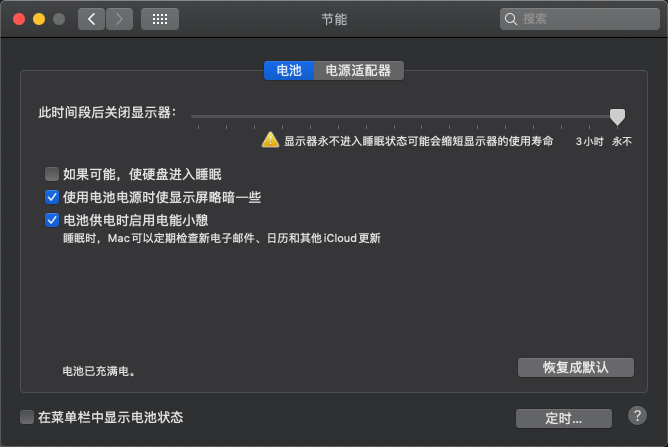
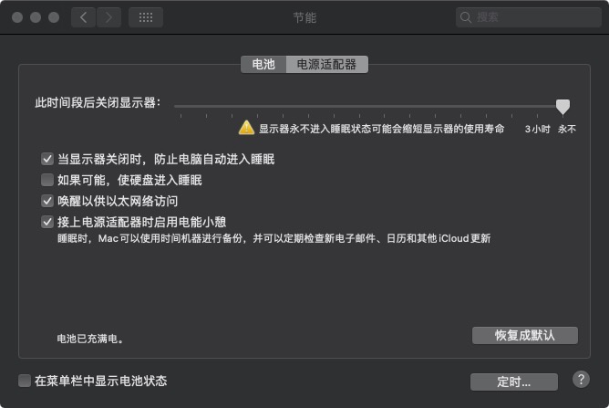

# HackIntosh-Hasee-G8-CT7NA
神舟G8 CT7NA  黑苹果10.15 Clover 配置文件

理论来说这个模具[NH70RD]的或类似模具的[NH5xRD_RC_RA_RH(Q)/NH70RD_RC_RA_RH(Q)]都通用

> 源自 https://github.com/bufsnake/Z7-CT7NA-HackIntosh

> 部分问题讨论和解答 https://github.com/bufsnake/Z7-CT7NA-HackIntosh/issues/2

#### 存在问题和替代方案

- 睡眠有时睡死/重启/关机
> 防止进入睡眠

> 
> 

- WIFI不能用
> 可更换m.2支持免驱的网卡解决/可以直插网线/可以手机连wifi然后usb共享给mac

- 触摸板鸡肋
> 键盘快捷键代替

- 快捷键不能调节亮度
> 可以在设置中用鼠标调

#### 其他功能目前看来都正常
